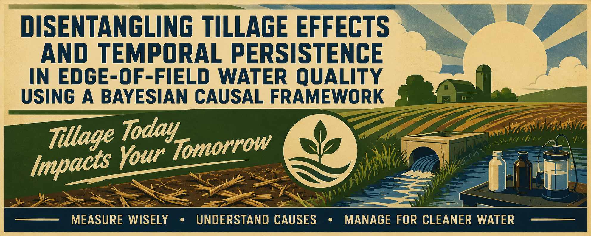

# Chapter 2 Tillage Impacts on Water Quality

**Author:** AJ Brown ([ansleybrown1337](https://github.com/ansleybrown1337))  
**Contact:** [ansley.brown@colostate.edu](mailto:ansley.brown@colostate.edu)  
**Program:** [CSU Agricultural Water Quality Program](https://waterquality.colostate.edu)

This repository contains the Python data-processing workflow and Bayesian
modeling code for the Kerbel long-term tillage impacts water-quality analysis.
It is intended as a focused release archive for the Chapter 2 manuscript and
Zenodo citation. This work is part of AJ Brown's PhD dissertation research in
partial fulfillment of the degree requirements at Colorado State University.
The underlying field data were collected as part of the CSU Agricultural Water
Quality Program.

The workflow integrates edge-of-field water-quality observations, crop records,
tillage operations, STIR metrics, and residue measurements into a Bayesian
analysis dataset. Version 2.1 (`v2p1`) is the final selected Bayesian workflow
used for formal inference. It estimates STIR effects on runoff concentration,
runoff volume, and annual constituent loads while propagating uncertainty
through concentration, volume, inflow, residue, and year effects.

## Contents

```text
code/    Python pipeline scripts, Bayesian Rmd drivers, Stan model source
data/    Raw project inputs used by the pipeline
docs/    Method notes for the data pipeline, STIR calculations, and Bayes models
figs/    Final v2p1 Bayesian model figures
out/     Processed pipeline outputs and final v2p1 Bayesian model outputs
```

## What Is Included

- Python pipeline from raw data to `out/wq_cleaned.csv`
- Final selected Bayesian model source and driver:
  - selected inference workflow: `code/stir-bayes-load2p1_nonneg.Rmd`
  - selected Stan source: `code/m_stir_mogp_v2p1.stan`
- Final v2p1 Bayesian output CSVs and figures
- Method documentation relevant to the Chapter 2 tillage and water-quality
  analysis

## Reproducing The Python Data Pipeline

Create a Python environment with the packages in `requirements.txt`, then run
from the repository root:

```bash
python code/run_pipeline.py --debug
```

The pipeline runs the following steps:

1. `code/wq_longify.py`
2. `code/stir_pipeline.py`
3. `code/merge_wq_stir_by_season.py`
4. `code/merge_residue.py`
5. `code/stir_bayes_backend.py`

The final Bayes-ready dataset is:

```text
out/wq_cleaned.csv
```

Intermediate pipeline outputs are written under:

```text
out/pipeline_csvs/
```

## Running The Bayesian Workflows

The Bayesian workflows are implemented in R Markdown and Stan. The R workflows
expect `cmdstanr`, `posterior`, `rethinking`, and tidyverse-style data packages.
Install CmdStan and configure `cmdstanr` before fitting models.

Final selected inference workflow:

```text
code/stir-bayes-load2p1_nonneg.Rmd
code/m_stir_mogp_v2p1.stan
```

The v2p1 workflow corrects unit-of-analysis pseudo-replication by modeling:

- outflow volume once per volume-measurement event;
- inflow volume once per physical plot runoff event; and
- residue once per planting-season plot unit.

The v2p1 workflow is the final and selected version for formal inference in
this release.

## Key Outputs

- `out/wq_cleaned.csv`
- `out/annual_load_summary_bayes_v2p1.csv`
- `out/annual_load_summary_bayes_plus_observed_v2p1.csv`
- `out/annual_load_draws_bayes_v2p1.csv`
- `out/study_period_total_loads_kg_v2p1.csv`
- `out/annual_volume_kL_wide_modeled_v2p1.csv`
- `out/annual_volume_kL_wide_observed_v2p1.csv`

Audit files for v2p1 event, VIN, and residue mappings are also included in
`out/`.

## Documentation

- `docs/README_data_pipeline.md`
- `docs/README_bayes_methods.md`
- `docs/README_bayes_methods_v2p1_notes.md`
- `docs/bayes-model_versions.md`
- `docs/STIR calculations.md`
- `docs/STIR calculations.pdf`

## License

This release uses the GNU General Public License v2.0. See `LICENSE` for details.
